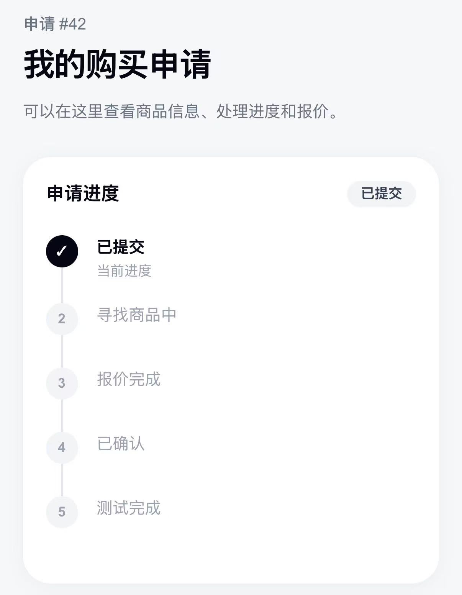

# CK-Bridge

[한국어](./README.kr.md) | [中文](./README.zh-CN.md) | [English](./README.en.md)

중국 사용자가 한국 상품명을 정확히 몰라도 이미지나 상품 링크를 통해 한국 상품을 탐색하고, 중국 사용자 기준의 가격·옵션·예상 배송비를 확인한 뒤 견적을 요청할 수 있도록 만든 크로스보더 커머스 MVP입니다.

> 현재 CK-Bridge는 실제 결제 및 구매를 지원하지 않는 테스트·포트폴리오용 MVP입니다.

# CK-Bridge

[한국어](./README.kr.md) | [中文](./README.zh-CN.md) | [English](./README.en.md)

## 목차

- [1. 프로젝트 개요](#1-프로젝트-개요)
- [주요 화면](#주요-화면)
- [2. 문제 정의](#2-문제-정의)
- [3. 초기 가설](#3-초기-가설)
- [4. 핵심 기능](#4-핵심-기능)
- [5. 사용자 흐름](#5-사용자-흐름)
- [8. 사용자 테스트](#8-사용자-테스트)
- [9. 사용자 테스트 결과](#9-사용자-테스트-결과)
- [10. 사용자 피드백](#10-사용자-피드백)
- [11. 테스트 이후 개선 및 추가 구현](#11-테스트-이후-개선-및-추가-구현)
- [12. 개발 과정에서 해결한 문제](#12-개발-과정에서-해결한-문제)
- [13. 프로젝트에서 맡은 역할](#13-프로젝트에서-맡은-역할)
- [14. 프로젝트를 통해 배운 점](#14-프로젝트를-통해-배운-점)
- [15. 프로젝트의 한계](#15-프로젝트의-한계)
- [16. 향후 확장 가능성](#16-향후-확장-가능성)
- [17. 프로젝트 링크](#17-프로젝트-링크)

---

중국 사용자가 한국 상품명을 정확히 몰라도...

---

## 1. 프로젝트 개요

CK-Bridge는 중국 사용자를 대상으로 한 **한국 상품 탐색 및 견적 요청 서비스**입니다.

이미 중국에서 유명한 한국 상품은 타오바오 등 중국 플랫폼에서도 쉽게 검색할 수 있습니다.

하지만 모든 한국 상품이 중국 플랫폼에 판매되고 있는 것은 아니며, SNS나 사진을 통해 처음 접한 상품이나 중국 내 유통이 적은 상품은 정확한 한국어 상품명과 판매처를 알지 못하면 찾기 어려울 수 있습니다.

CK-Bridge는 이런 상황에서 사용자가 다음 방식 중 하나로 상품 탐색을 시작할 수 있도록 제작했습니다.

- 상품 사진 업로드
- 한국 쇼핑몰 상품 링크 입력
- 추천 상품 탐색

이후 상품 정보와 예상 비용을 확인하고 견적을 요청할 수 있도록 구성했습니다.

---

## 주요 화면

### 홈 화면

<p>
  
</p>

사용자는 추천 상품, 이미지 기반 상품 찾기, 한국 상품 링크 입력 중 원하는 방식으로 탐색을 시작할 수 있습니다.

### AI 이미지 기반 상품 탐색

<p>
  
  
</p>

상품 사진을 업로드하면 AI가 상품 특징을 분석하고, 예상 무게·국제배송비·추천 검색어를 제공합니다.

### 추천 상품 탐색

<p>
  
</p>

추천 상품 목록에서는 CNY 판매가, 한국 참고 가격, 할인 정보 등을 확인할 수 있습니다.

### 상품 상세 및 옵션 선택

<p>
  
</p>

상품 상세 화면에서 예상 무게와 배송비를 확인하고 옵션별 수량을 선택할 수 있습니다.

### 상품 링크를 통한 견적 요청

<p>
  
</p>

이미 한국 쇼핑몰의 상품 링크를 알고 있다면 링크와 상품 정보를 입력해 바로 견적을 요청할 수 있습니다.

### 견적 진행 상태 및 1:1 문의

<p>
  
  
</p>

견적 요청 이후 처리 상태를 확인하고 요청별로 관리자와 메시지를 주고받을 수 있습니다.

### 관리자 페이지

<p>
  
  
</p>

관리자는 견적 요청, 고객 채팅, 추천 상품을 관리할 수 있습니다.

### 관리자 가격 관리

<p>
  
</p>

한국 판매 가격과 현재 환율을 기준으로 CNY 판매가를 계산하고, 가격 조정값과 중국 정가를 설정할 수 있습니다.

---

## 2. 문제 정의

중국 사용자가 한국 상품을 찾거나 구매하려고 할 때 다음과 같은 상황이 발생할 수 있다고 가정했습니다.

### 문제 1. 이미지로 본 상품은 정확한 한국어 상품명을 알기 어렵다

중국 SNS나 사진을 통해 한국 상품을 접해도 브랜드명이나 정확한 한국어 상품명을 모르는 경우가 있습니다.

이 경우 한국 쇼핑몰에서 직접 검색하기 어렵고, 원하는 상품을 찾기 위해 별도의 검색 과정이 필요할 수 있습니다.

### 문제 2. 중국 플랫폼에 없는 한국 상품은 탐색 과정이 복잡해질 수 있다

이미 중국에서 인기가 높은 한국 상품은 타오바오 등에서 쉽게 찾을 수 있습니다.

하지만 다음과 같은 상품은 중국 플랫폼에서 바로 찾기 어려울 수 있습니다.

- 중국 내 유통이 적은 상품
- 소규모 한국 브랜드 상품
- 출시된 지 오래되지 않은 상품
- SNS나 이미지로 처음 접한 상품
- 특정 한국 쇼핑몰에서만 판매하는 상품

이런 경우 사용자는 직접 한국 사이트를 검색하거나 다른 사람에게 상품 정보를 문의해야 할 수 있습니다.

### 문제 3. 한국 상품 정보를 중국 사용자 기준으로 다시 이해해야 한다

한국 쇼핑몰의 상품 정보는 기본적으로 한국 사용자를 기준으로 제공됩니다.

예를 들어:

- 가격은 KRW로 표시
- 상품 옵션은 한국어 중심
- 중국까지의 국제배송비는 바로 알기 어려움

따라서 중국 사용자가 상품을 찾았더라도 다시 가격을 계산하거나 배송비와 옵션을 별도로 확인해야 할 수 있습니다.

---

## 3. 초기 가설

다음과 같은 가설을 세웠습니다.

> 중국 사용자가 정확한 한국어 상품명을 몰라도 이미지나 링크를 통해 상품 탐색을 시작할 수 있고, 상품 정보와 예상 비용을 중국 사용자 기준으로 확인할 수 있다면 한국 상품 구매 과정의 불편함을 줄일 수 있을 것이다.

이를 검증하기 위해 실제 구매·결제 시스템 전체를 구현하기보다 다음 경험을 중심으로 MVP를 제작했습니다.

```text
상품 발견
→ 상품 정보 확인
→ 가격 / 옵션 / 배송비 확인
→ 견적 요청
→ 관리자와 문의
```

---

## 4. 핵심 기능

### 4.1 이미지 기반 한국 상품 탐색

사용자가 한국 상품 사진을 업로드하면 AI가 이미지 속 상품 정보를 분석합니다.

사용자는 정확한 한국어 상품명을 모르더라도 사진을 기반으로 상품 탐색을 시작할 수 있습니다.

---

### 4.2 한국 상품 링크 견적 요청

이미 원하는 상품의 한국 쇼핑몰 링크를 알고 있는 사용자는 링크를 직접 입력해 견적을 요청할 수 있습니다.

---

### 4.3 추천 한국 상품

특정 상품을 찾고 있지 않은 사용자도 추천 상품 목록에서 한국 상품을 탐색할 수 있도록 구현했습니다.

추천 상품에서는 다음 정보를 확인할 수 있습니다.

- 상품 이미지
- 판매처
- 현재 환율을 반영한 CNY 판매가
- KRW 참고 가격
- 할인 정보
- 간단한 상품 설명

---

### 4.4 상품 옵션별 수량 선택

색상, 맛, 사이즈 등 상품별 옵션을 관리자가 등록할 수 있도록 구현했습니다.

사용자는 각 옵션별로 원하는 수량을 직접 선택할 수 있습니다.

예시:

```text
颜色

红色       [-] 0 [+]
蓝色       [-] 2 [+]
黄色       [-] 1 [+]

合计：3件
```

선택한 옵션과 수량은 견적 요청 시 함께 전달됩니다.

---

### 4.5 KRW → CNY 자동 환산

한국 판매 가격을 현재 환율에 따라 중국 위안화(CNY)로 자동 환산합니다.

고객 화면에서는 CNY 가격을 우선적으로 표시하고, 한국 원화 가격은 참고 정보로 제공합니다.

예시:

```text
¥99

₩19,900 韩国参考售价
```

---

### 4.6 가격 조정 및 자동 할인율

관리자는 환율 환산 가격을 기준으로 CNY 가격을 조정할 수 있습니다.

예시:

```text
한국 판매 가격: ₩33,900
환율 기준 가격: ¥174
가격 조정: +5
실제 판매가: ¥179
```

정가가 실제 판매가보다 높은 경우 할인율을 자동으로 계산해 고객 화면에 표시합니다.

예시:

```text
¥179   10% OFF
¥199
```

정가와 판매가가 같거나 정가가 없는 경우 할인율은 표시하지 않습니다.

---

### 4.7 AI 기반 예상 상품 무게

상품의 실제 무게 정보가 없는 경우 AI를 이용해 예상 무게를 계산합니다.

한 번 계산된 예상 무게는 DB에 저장해 같은 상품에서 AI API가 반복 호출되지 않도록 했습니다.

---

### 4.8 예상 국제배송비

예상 상품 무게를 기준으로 중국까지의 참고 국제배송비를 계산해 보여줍니다.

현재 MVP에서는 테스트를 위해 다음 참고 배송요율을 사용했습니다.

```text
첫 1kg: ¥38
이후 1kg마다: +¥12
```

실제 물류비와 차이가 있을 수 있기 때문에 참고용 예상 금액으로 표시합니다.

---

### 4.9 견적 요청 상태 확인

사용자는 자신의 견적 요청 페이지에서 현재 처리 상태를 확인할 수 있습니다.

관리자는 관리자 페이지에서 요청 상태와 견적 정보를 수정할 수 있습니다.

---

### 4.10 1:1 문의 채팅

각 견적 요청마다 사용자와 관리자가 메시지를 주고받을 수 있도록 구현했습니다.

관리자 화면에서는 마지막 메시지와 읽지 않은 메시지를 확인할 수 있습니다.

---

### 4.11 관리자 페이지

관리자는 다음 기능을 사용할 수 있습니다.

- 견적 요청 확인
- 요청 상태 변경
- 견적 정보 입력
- 요청별 채팅 확인
- 읽지 않은 메시지 확인
- 추천 상품 등록 / 수정 / 삭제
- 상품 노출 / 숨김
- 상품 이미지 관리
- 상품 옵션 관리
- 가격 조정
- 정가 및 할인 설정

---

## 5. 사용자 흐름

### 추천 상품에서 시작하는 경우

```text
추천 상품 목록
→ 상품 상세
→ 옵션 / 수량 선택
→ 견적 신청
→ 1:1 문의
```

### 이미지로 상품을 찾는 경우

```text
상품 이미지 업로드
→ AI 이미지 분석
→ 상품 탐색
→ 상품 정보 확인
→ 견적 요청
```

### 한국 상품 링크를 알고 있는 경우

```text
한국 상품 링크 입력
→ 상품 정보 입력
→ 견적 요청
→ 관리자 확인
→ 견적 결과 확인
```

---

## 6. 관리자 기능

관리자 페이지에서는 서비스 운영에 필요한 기능을 관리할 수 있습니다.

### 견적 요청 관리

- 전체 요청 확인
- 요청 내용 확인
- 요청 상태 변경
- 견적 정보 입력

### 채팅 관리

- 요청별 채팅 확인
- 마지막 메시지 확인
- 안 읽은 사용자 메시지 표시
- 메시지 읽음 처리
- 안 읽음으로 다시 표시

### 추천 상품 관리

- 상품 등록
- 상품 수정
- 상품 삭제
- 상품 숨김
- 상품 다시 표시
- 대표 이미지 등록
- 상세 이미지 등록
- 상품 옵션 등록
- 옵션 선택지 관리
- 한국 판매 가격 입력
- CNY 가격 조정
- 중국 정가 입력
- 자동 할인율 확인

---

## 7. 기술 스택

### Frontend

- Next.js 16
- React
- TypeScript
- Tailwind CSS

### Backend

- Next.js API Routes

### Database / Storage

- Supabase
- Supabase Storage

### AI

- Alibaba Cloud Model Studio
- Qwen Vision Language Model

### External API

- KRW → CNY 환율 API

### Deployment

- Vercel
- Custom Domain

---

## 8. 사용자 테스트

MVP 구현 후 중국 사용자 5명을 대상으로 테스트를 진행했습니다.

테스트 목적은 서비스를 실제 사용자가 어떻게 이해하는지 확인하고, 개발자가 예상하지 못한 문제를 찾는 것이었습니다.

테스트에서는 다음 내용을 확인했습니다.

- 서비스 사용 난이도
- 견적 정보 이해도
- 구매 의향
- 재사용 의향
- 가장 유용하다고 느낀 기능
- 불편했던 부분
- 추가로 필요한 기능

사용자 수가 5명으로 적기 때문에 테스트 결과를 전체 중국 소비자의 의견으로 일반화하지 않고, **초기 탐색적 사용자 테스트**로 활용했습니다.

---

## 9. 사용자 테스트 결과

### 구매 의향

총 5명 중:

- 구매 의향 있음: 1명
- 상황에 따라 사용할 수 있음: 4명

### 재사용 의향

- 다시 사용할 의향 있음: 3명
- 상황에 따라 사용할 수 있음: 2명

### 서비스 사용 난이도

- 매우 쉬움: 2명
- 쉬움: 3명

### 견적 정보 이해도

- 매우 명확함: 2명
- 명확함: 3명

### 유용하다고 평가된 기능

| 기능 | 선택 인원 |
|---|---:|
| 인기 상품 추천 | 4 / 5 |
| 이미지 기반 상품 찾기 | 4 / 5 |
| 견적 확인 | 3 / 5 |
| 상품 링크 요청 | 2 / 5 |
| 채팅 | 2 / 5 |

---

## 10. 사용자 피드백

### 10.1 추천 상품이 생각보다 유용했다

초기에는 이미지 기반 상품 탐색을 핵심 기능으로 생각했습니다.

그러나 사용자 테스트에서는 추천 상품 기능도 이미지 검색과 동일하게 5명 중 4명이 유용하다고 평가했습니다.

이를 통해 사용자가 항상 특정 상품을 찾으러 오는 것은 아니며, 상품 탐색 자체에도 수요가 있을 수 있다고 판단했습니다.

---


### 10.2 상품 옵션과 수량 선택이 필요했다

패션, 식품, 화장품 등은 색상이나 맛 등의 옵션이 여러 개 존재합니다.

테스트 이후 관리자가 옵션을 자유롭게 등록하고, 고객이 각 옵션별로 수량을 선택할 수 있는 기능을 추가했습니다.

---

### 10.3 초기 화면의 정보가 많았다

기능을 설명하기 위해 많은 내용을 한 화면에 배치했지만 오히려 서비스 사용 방법이 복잡하게 느껴질 수 있었습니다.

이를 개선하기 위해 홈 화면의 주요 기능 순서를 단순화했습니다.

```text
추천 상품
→ 이미지로 찾기
→ 상품 링크로 요청
```

---

### 10.4 서비스 신뢰 문제를 확인했다

일부 사용자는 처음 보는 사이트이기 때문에 실제 구매 사이트인지, 안전한 사이트인지 판단하기 어려워했습니다.

이는 작은 개인 MVP가 실제 커머스 서비스를 운영할 때 발생할 수 있는 중요한 문제라고 판단했습니다.

현재 프로젝트는 실제 상용 서비스를 목표로 운영하지 않고 포트폴리오용 MVP로 마무리했으며, 고객 화면에 테스트 버전임을 명확히 표시했습니다.

---

## 11. 테스트 이후 개선 및 추가 구현

사용자 테스트 이후, 직접 받은 피드백을 반영한 개선과 MVP의 완성도를 높이기 위한 추가 구현을 진행했습니다.

### 사용자 피드백을 반영한 개선

- 상품 옵션 관리 기능 추가
- 옵션별 수량 선택 기능 추가
- 홈 화면 구조 단순화
- 추천 상품 탐색 기능 강화
- 테스트 버전 안내 강화

### MVP 완성도를 높이기 위해 추가한 기능

- CNY 가격을 주요 가격으로 표시
- KRW 가격을 참고 정보로 표시
- 현재 환율 자동 반영
- 관리자 가격 조정 기능 추가
- 정가 및 자동 할인율 기능 추가
- AI 기반 예상 상품 무게 기능 추가
- 예상 국제배송비 기능 추가
- 관리자 채팅 Inbox 추가
- 읽지 않은 메시지 표시 기능 추가

---

## 12. 개발 과정에서 해결한 문제

### 12.1 옵션 수량이 동시에 증가하는 문제

초기 상품 옵션 구현 후 한 옵션의 `+` 버튼을 눌렀을 때 다른 옵션의 수량까지 동시에 증가하는 문제가 발생했습니다.

브라우저 콘솔에서는 다음과 같은 React 경고가 발생했습니다.

```text
Encountered two children with the same key
```

원인은 중복된 옵션 값이 존재할 경우 React의 key와 옵션 상태값이 동일한 문자열을 공유하는 구조였습니다.

초기에는 다음과 같이 옵션을 구분했습니다.

```text
옵션 종류 + 옵션값
```

이를 다음과 같이 각 옵션의 위치를 기반으로 관리하도록 변경했습니다.

```text
groupIndex + valueIndex
```

또한 DB에 과거 중복된 옵션 값이 존재하더라도 고객 화면에서는 중복 값을 제거하여 보여주도록 수정했습니다.

---

### 12.2 AI 무게 API 반복 호출 문제

상품 상세 페이지에 들어갈 때마다 AI 무게 추정 API를 호출하면 API 비용과 응답 시간이 불필요하게 증가할 수 있었습니다.

따라서 다음 구조로 변경했습니다.

```text
상품 DB에 무게 존재
→ DB 무게 사용

상품 DB에 무게 없음
→ AI 무게 추정
→ 결과를 DB에 저장
→ 이후 DB 값 사용
```

이를 통해 동일 상품에 대한 반복 AI 호출을 줄였습니다.

---

### 12.3 관리자 기능 보호

추천 상품 등록, 견적 수정 등 관리자 기능이 일반 사용자에게 노출되지 않도록 관리자 인증 기능을 구현했습니다.

관리자 로그인 후 HMAC 기반 세션 쿠키를 사용하여 관리자 API 접근 여부를 확인하도록 구성했습니다.

또한 Supabase 관리자 권한이 필요한 기능은 브라우저에서 직접 실행하지 않고 서버 API를 통해 처리하도록 했습니다.

---

### 12.4 환율 변화에 대응하는 판매 가격

처음에는 CNY 판매 가격을 관리자가 직접 고정값으로 입력하는 방법도 고려했습니다.

하지만 환율이 바뀔 때마다 모든 상품 가격을 다시 수정해야 하는 문제가 있었습니다.

따라서 최종 판매가 자체를 저장하지 않고 **가격 조정값**을 저장하도록 변경했습니다.

```text
한국 판매 가격
× 현재 KRW/CNY 환율
+ 관리자 가격 조정
= 고객 판매 가격
```

이를 통해 환율이 변경되면 고객 가격도 자동으로 변경됩니다.

---

## 13. 프로젝트에서 맡은 역할

개인 프로젝트로 기획부터 배포까지 전체 과정을 직접 진행했습니다.

- 아이디어 기획
- 문제 정의
- 서비스 구조 설계
- 사용자 흐름 설계
- UI 구현
- Frontend 개발
- Backend API 개발
- Supabase DB 설계
- 이미지 Storage 연동
- AI API 연동
- 환율 API 연동
- 관리자 페이지 구현
- 사용자 테스트 설계
- 중국 사용자 테스트 진행
- 테스트 결과 분석
- 피드백 기반 기능 개선
- Vercel 배포
- Custom Domain 연결

---

## 14. 프로젝트를 통해 배운 점

### 14.1 내가 중요하다고 생각한 기능과 사용자가 중요하게 생각한 기능은 다를 수 있다

개발 초기에는 이미지 기반 상품 탐색 기능을 가장 중요한 기능이라고 생각했습니다.

하지만 실제 테스트에서는 추천 상품 기능도 이미지 상품 찾기와 동일하게 높은 평가를 받았습니다.

이를 통해 개발 전에 예상한 기능 우선순위와 실제 사용자 평가가 다를 수 있다는 점을 확인했습니다.

---

### 14.2 이미 잘 해결된 문제를 다시 해결할 필요는 없다

유명한 한국 상품은 타오바오 등 중국 플랫폼에서도 이미 쉽게 구매할 수 있습니다.

따라서 CK-Bridge가 모든 한국 상품 구매 경험을 대체해야 한다는 접근은 적절하지 않다고 판단했습니다.

대신 중국 플랫폼에서 바로 찾기 어려운 상품이나 이미지로 처음 발견한 상품처럼 기존 서비스가 충분히 해결하지 못하는 상황에 집중하는 것이 더 중요하다는 점을 배웠습니다.

---

### 14.3 단순 번역과 현지화는 다르다

서비스 화면을 중국어로 번역하는 것만으로 중국 사용자를 위한 서비스가 완성되는 것은 아니었습니다.

실제 테스트 과정에서 상품 옵션 선택 방식, 배송비 정보, 화면의 정보량처럼 언어 번역 외의 요소도 사용자 경험에 영향을 준다는 점을 확인했습니다.

이를 통해 현지화는 단순히 문장을 번역하는 것이 아니라 현지 사용자가 정보를 이해하고 행동하는 방식까지 고려하는 과정이라는 점을 배웠습니다.

---

### 14.4 기능 수보다 사용 흐름이 중요하다

처음에는 기능을 많이 설명하면 사용자가 서비스를 더 잘 이해할 것이라고 생각했습니다.

하지만 실제로는 정보가 많아질수록 사용자가 무엇부터 해야 하는지 알기 어려워질 수 있었습니다.

따라서 핵심 행동을 중심으로 홈 화면 구조를 단순화했습니다.

---

### 14.5 MVP에서는 범위를 제한하는 것이 중요하다

실제 구매대행 서비스를 운영하려면 다음과 같은 기능도 필요합니다.

- 회원 시스템
- 결제
- 물류
- 환불
- 반품
- 고객 인증
- 법률 및 세금 처리

하지만 모든 기능을 구현하면 프로젝트 규모가 지나치게 커집니다.

따라서 이번 프로젝트에서는 **상품을 발견하고 견적을 요청하는 경험**에 집중했습니다.

---

## 15. 프로젝트의 한계

CK-Bridge는 실제 상용 서비스가 아닌 테스트 및 포트폴리오 목적의 MVP입니다.

따라서 다음 기능은 구현하지 않았습니다.

- 실제 결제
- 실제 상품 구매
- 중국 배송 주소 관리
- 실제 물류사 API 연동
- 주문 추적
- 환불 및 반품
- 정식 회원가입
- WeChat 로그인
- 대규모 상품 데이터
- 실제 구매대행 운영 시스템

AI 상품 탐색 역시 항상 정확한 실제 상품을 찾는다고 보장할 수 없습니다.

또한 사용자 테스트 인원이 5명으로 제한되어 있기 때문에 테스트 결과는 시장 전체의 의견이 아니라 초기 사용자 반응을 확인하기 위한 탐색적 결과입니다.

---

## 16. 향후 확장 가능성

실제 서비스로 발전시킨다면 다음 기능을 검토할 수 있습니다.

- 상품 카테고리
- 상품 검색
- WeChat 로그인
- 사용자 계정
- 중국 배송 주소 저장
- 실제 국제물류 API 연동
- 실제 배송비 계산
- 결제
- 주문 관리
- 배송 추적
- 환불 / 반품
- 상품 비교
- 사용자 리뷰
- 더 많은 중국 사용자 대상 테스트

---

## 17. 프로젝트 링크

### 서비스

https://ckbridgeshop.cn

### GitHub

https://github.com/haehwan2/reverse-shopping

---

## 안내

CK-Bridge는 서비스 아이디어 검증 및 포트폴리오 목적으로 제작한 MVP입니다.

현재 실제 결제 및 상품 구매는 지원하지 않습니다.