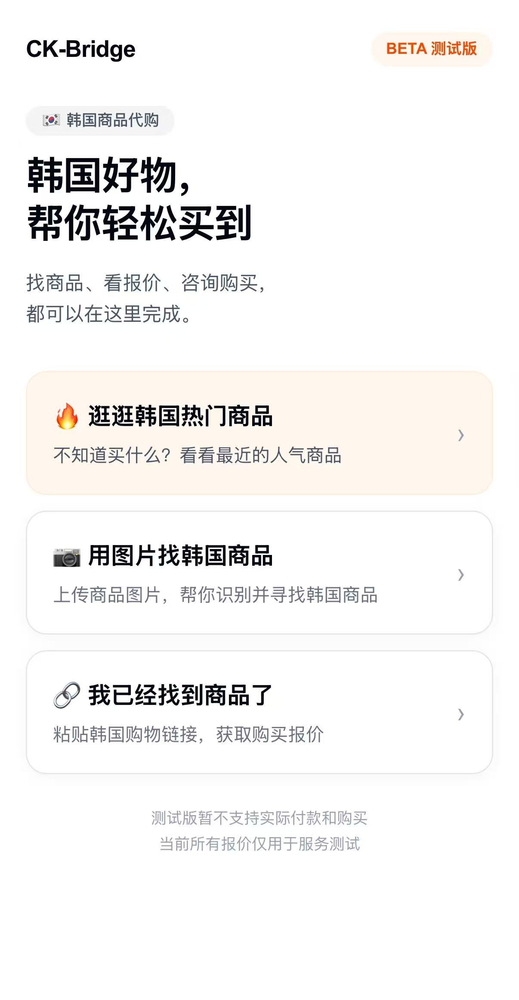
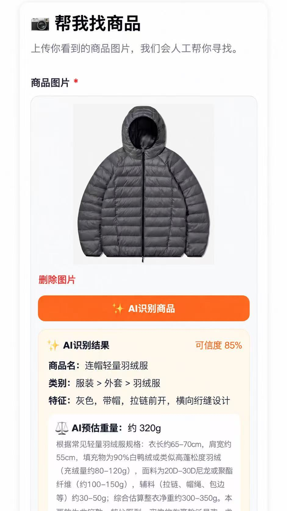
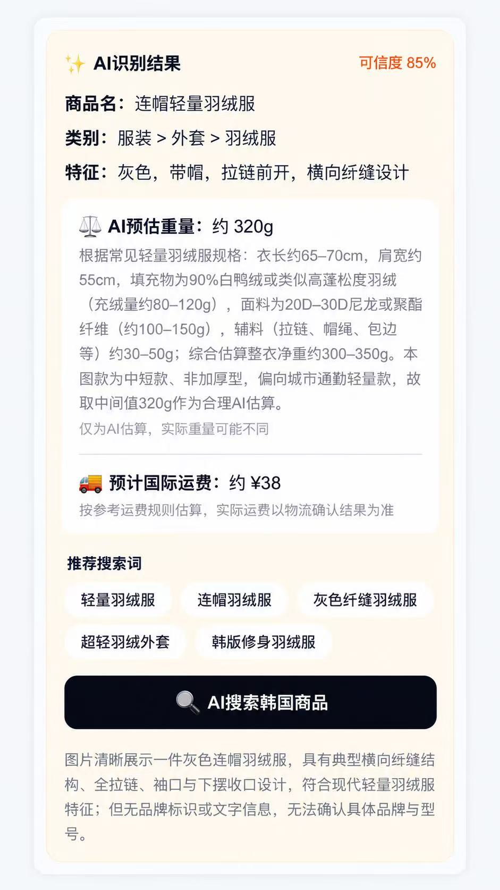
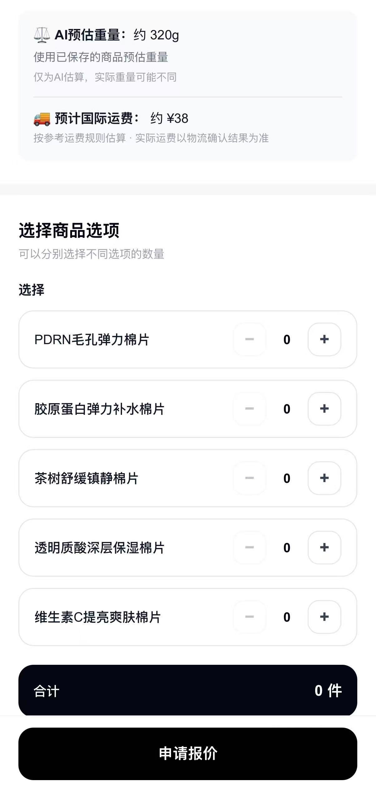
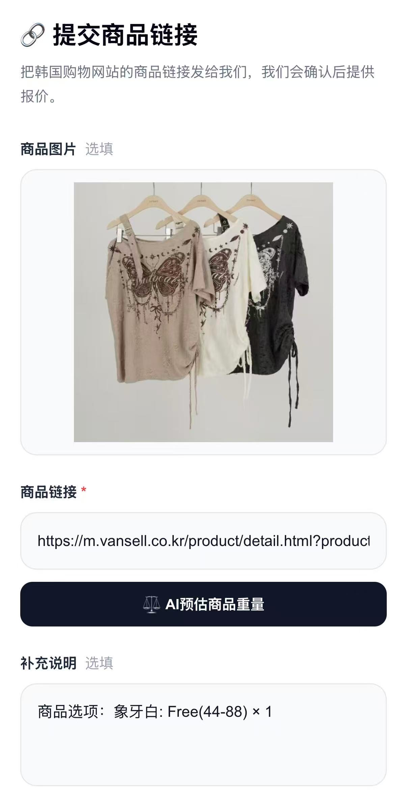
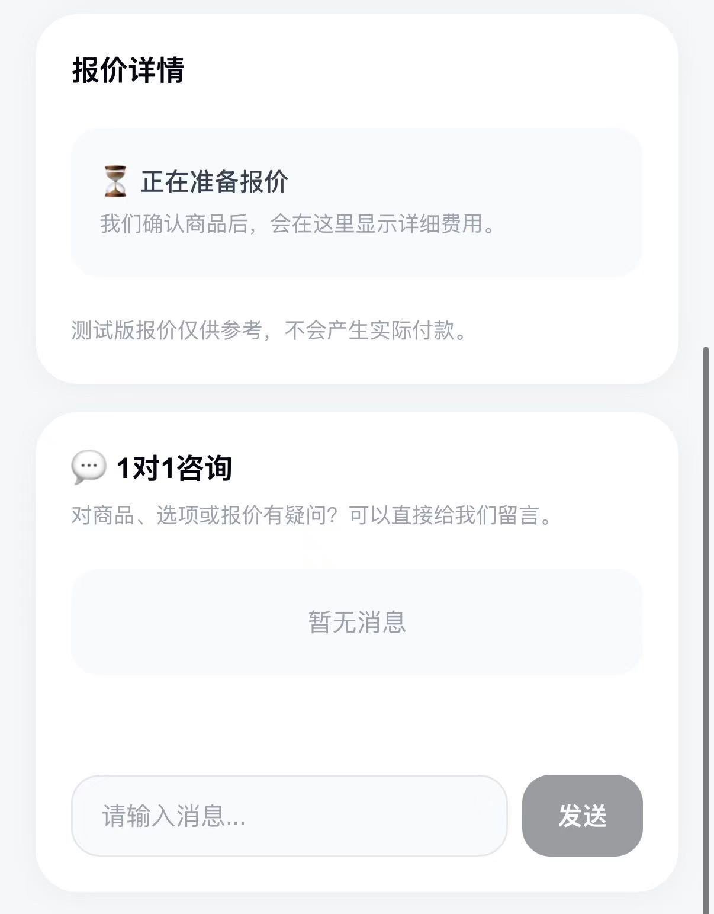
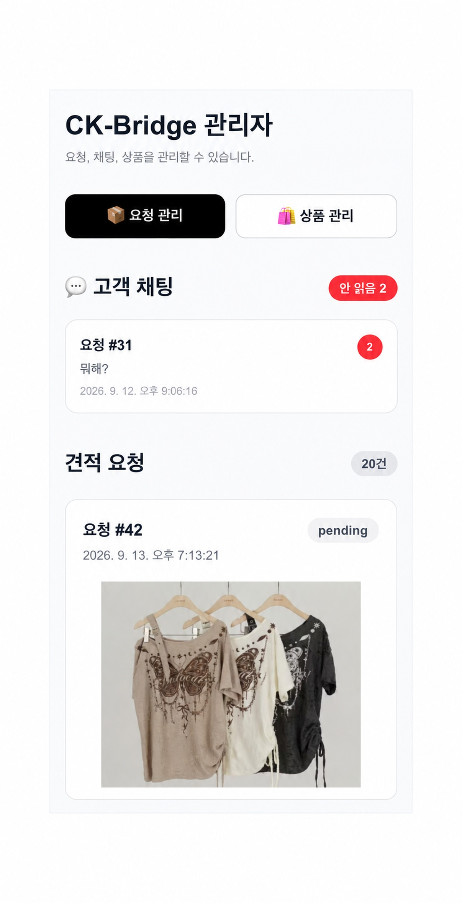
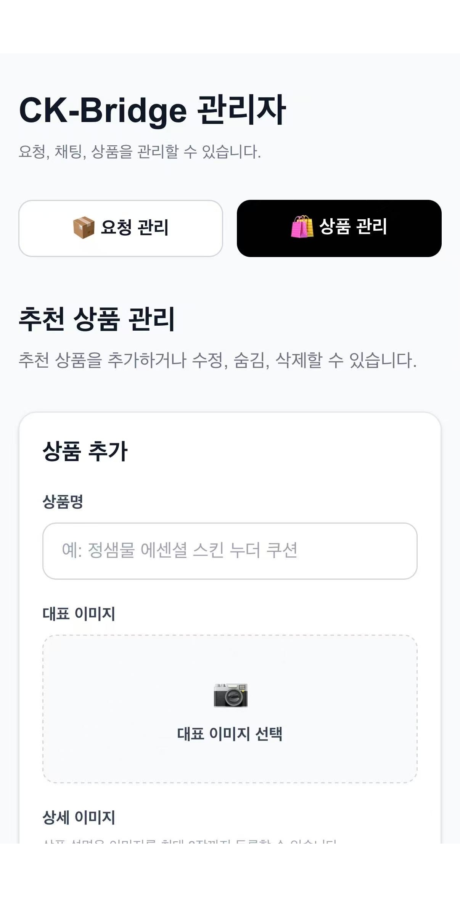
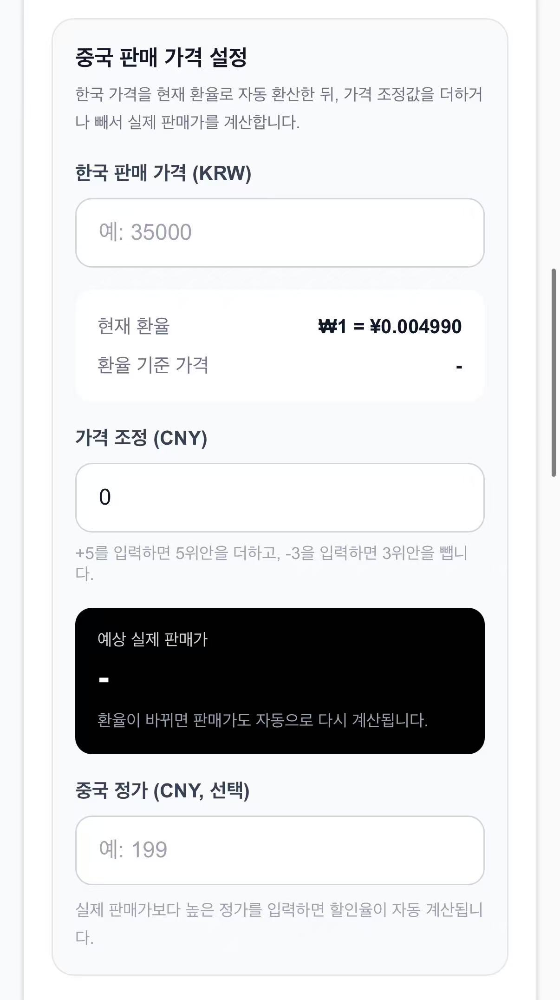

# CK-Bridge

[한국어](./README.kr.md) | [中文](./README.zh-CN.md) | [English](./README.en.md)

CK-Bridge 是一个面向中国用户的跨境电商 MVP。即使用户不知道韩国商品的准确名称，也可以通过图片或商品链接探索韩国商品，并在查看适合中国用户理解的价格、选项和预计运费后提交报价申请。

> 当前 CK-Bridge 为测试及作品集用途的 MVP，不支持实际付款和商品购买。

## 目录

- [1. 项目概述](#1-项目概述)
- [主要界面](#主要界面)
- [2. 问题定义](#2-问题定义)
- [3. 初始假设](#3-初始假设)
- [4. 核心功能](#4-核心功能)
- [5. 用户流程](#5-用户流程)
- [8. 用户测试](#8-用户测试)
- [9. 用户测试结果](#9-用户测试结果)
- [10. 用户反馈](#10-用户反馈)
- [11. 测试后的改进与补充实现](#11-测试后的改进与补充实现)
- [12. 开发过程中解决的问题](#12-开发过程中解决的问题)
- [13. 我在项目中的职责](#13-我在项目中的职责)
- [14. 通过项目学到的内容](#14-通过项目学到的内容)
- [15. 项目局限](#15-项目局限)
- [16. 未来扩展方向](#16-未来扩展方向)
- [17. 项目链接](#17-项目链接)

---

---

## 1. 项目概述

CK-Bridge 是一项面向中国用户的 **韩国商品探索与报价申请服务**。

已经在中国较为知名的韩国商品，通常可以直接在淘宝等中国平台上搜索到。

但并不是所有韩国商品都在中国平台上销售。对于通过 SNS 或图片第一次看到的商品，或在中国流通较少的商品，如果不知道准确的韩文商品名和销售渠道，用户可能较难找到对应商品。

CK-Bridge 允许用户通过以下方式开始商品探索：

- 上传商品图片
- 输入韩国购物网站商品链接
- 浏览推荐商品

之后，用户可以查看商品信息和预计费用，并提交报价申请。

---

## 主要界面

### 首页

  

用户可以从推荐商品、图片找商品、韩国商品链接输入三种方式中选择适合自己的入口。

### AI 图片商品探索

  
  

上传商品图片后，AI 会分析商品特征，并提供预计重量、国际运费和推荐搜索关键词。

### 推荐商品探索

  

在推荐商品列表中，可以查看 CNY 售价、韩国参考价格、折扣信息等。

### 商品详情与选项选择

  

在商品详情页中，可以查看预计重量和运费，并按不同商品选项选择数量。

### 通过商品链接申请报价

  

如果用户已经知道韩国购物网站中的商品链接，可以直接输入链接和商品信息申请报价。

### 报价进度与 1:1 咨询

  

提交报价申请后，用户可以查看处理状态，并在每个申请页面中与管理员进行消息沟通。

### 管理员页面

  
  

管理员可以管理报价申请、用户消息和推荐商品。

### 管理员价格管理

  

系统根据韩国售价和当前汇率计算 CNY 售价，管理员还可以设置价格调整值和中国市场参考原价。

---

## 2. 问题定义

我们假设，中国用户在寻找或购买韩国商品时可能遇到以下问题。

### 问题 1. 仅凭图片难以知道准确的韩文商品名

中国用户即使通过 SNS 或图片看到韩国商品，也可能不知道品牌名或准确的韩文商品名。

这种情况下，用户难以直接在韩国购物网站中搜索，需要额外寻找商品信息。

### 问题 2. 中国平台上没有销售的韩国商品，探索过程较复杂

已经在中国较有人气的韩国商品，通常可以在淘宝等平台上轻松找到。

但以下商品可能无法直接在中国平台中找到：

- 在中国流通较少的商品
- 韩国小众品牌商品
- 上市时间较短的新品
- 通过 SNS 或图片第一次看到的商品
- 仅在特定韩国购物网站销售的商品

这种情况下，用户可能需要自己搜索韩国网站，或者向他人询问商品信息。

### 问题 3. 韩国商品信息需要重新转换为中国用户更容易理解的形式

韩国购物网站中的商品信息主要面向韩国用户。

例如：

- 价格以 KRW 显示
- 商品选项主要使用韩文
- 很难直接了解寄往中国的国际运费

因此，即使用户已经找到商品，也可能仍然需要重新计算价格、确认运费和商品选项。

---

## 3. 初始假设

我们提出了以下假设：

> 如果中国用户即使不知道准确的韩文商品名，也可以通过图片或链接开始寻找商品，并以中国用户更容易理解的方式查看商品信息和预计费用，那么就有可能降低购买韩国商品过程中的不便。

为了验证这一假设，我们没有实现完整的真实购买与支付系统，而是重点制作了以下核心体验：

发现商品
→ 查看商品信息
→ 确认价格 / 选项 / 运费
→ 申请报价
→ 与管理员咨询

---

## 4. 核心功能

### 4.1 基于图片的韩国商品探索

用户上传韩国商品图片后，AI 会分析图片中的商品信息。

即使不知道准确的韩文商品名，用户也可以通过图片开始商品探索。

---

### 4.2 韩国商品链接报价申请

如果用户已经知道想购买商品的韩国购物网站链接，可以直接输入商品链接并申请报价。

---

### 4.3 推荐韩国商品

即使用户没有明确想找的商品，也可以通过推荐商品列表浏览韩国商品。

推荐商品中可查看以下信息：

- 商品图片
- 销售渠道
- 根据当前汇率换算的 CNY 售价
- KRW 参考价格
- 折扣信息
- 简要商品说明

---

### 4.4 按商品选项选择数量

管理员可以为商品设置颜色、口味、尺寸等不同选项。

用户可以分别选择每个选项需要的数量。

示例：

颜色

红色       [-] 0 [+]
蓝色       [-] 2 [+]
黄色       [-] 1 [+]

合计：3件

所选择的选项和数量会在提交报价申请时一并传递。

---

### 4.5 KRW → CNY 自动换算

韩国售价会根据当前汇率自动换算成人民币（CNY）。

用户界面优先显示 CNY 价格，同时将韩元价格作为参考信息展示。

示例：

¥99

₩19,900 韩国参考售价

---

### 4.6 价格调整与自动折扣率

管理员可以基于汇率换算后的价格，对 CNY 售价进行调整。

示例：

韩国销售价格：₩33,900
汇率换算价格：¥174
价格调整：+5
实际售价：¥179

如果原价高于实际售价，系统会自动计算折扣率并显示在用户页面中。

示例：

¥179   10% OFF
¥199

当原价与售价相同，或没有设置原价时，不显示折扣率。

---

### 4.7 AI 预计商品重量

当商品没有实际重量信息时，系统通过 AI 估算商品重量。

估算结果会保存到数据库中，以避免用户再次查看同一商品时重复调用 AI API。

---

### 4.8 预计国际运费

系统根据预计商品重量，计算寄往中国的参考国际运费。

当前 MVP 为测试用途采用以下参考运费规则：

首重 1kg：¥38
之后每增加 1kg：+¥12

由于实际物流费用可能不同，因此该金额仅作为参考预计值显示。

---

### 4.9 报价申请状态查看

用户可以在自己的报价申请页面中查看当前处理状态。

管理员可以在后台修改申请状态和报价信息。

---

### 4.10 1:1 咨询聊天

每个报价申请都支持用户与管理员之间的消息交流。

管理员后台可以查看最后一条消息和未读消息。

---

### 4.11 管理员页面

管理员可以使用以下功能：

- 查看报价申请
- 修改申请状态
- 输入报价信息
- 查看申请对应的聊天
- 查看未读消息
- 推荐商品新增 / 修改 / 删除
- 商品显示 / 隐藏
- 商品图片管理
- 商品选项管理
- 价格调整
- 原价及折扣设置

---

## 5. 用户流程

### 从推荐商品开始

推荐商品列表
→ 商品详情
→ 选择选项 / 数量
→ 申请报价
→ 1:1 咨询

### 通过图片找商品

上传商品图片
→ AI 图片分析
→ 商品探索
→ 查看商品信息
→ 申请报价

### 已知韩国商品链接

输入韩国商品链接
→ 输入商品信息
→ 申请报价
→ 管理员确认
→ 查看报价结果

---

## 6. 管理员功能

管理员页面用于管理服务运营所需的各项功能。

### 报价申请管理

- 查看全部申请
- 查看申请内容
- 修改申请状态
- 输入报价信息

### 聊天管理

- 查看各申请对应的聊天
- 查看最后一条消息
- 显示未读用户消息
- 将消息标记为已读
- 重新标记为未读

### 推荐商品管理

- 新增商品
- 修改商品
- 删除商品
- 隐藏商品
- 重新显示商品
- 上传主图
- 上传详情图
- 添加商品选项
- 管理选项值
- 输入韩国售价
- 调整 CNY 价格
- 输入中国市场参考原价
- 查看自动折扣率

---

## 7. 技术栈

### Frontend

- Next.js 16
- React
- TypeScript
- Tailwind CSS

### Backend

- Next.js API Routes

### Database / Storage

- Supabase
- Supabase Storage

### AI

- Alibaba Cloud Model Studio
- Qwen Vision Language Model

### External API

- KRW → CNY 汇率 API

### Deployment

- Vercel
- Custom Domain

---

## 8. 用户测试

MVP 完成后，我们邀请了 5 名中国用户进行测试。

测试目的，是确认真实用户如何理解该服务，并发现开发者未预料到的问题。

测试主要确认以下内容：

- 服务使用难度
- 报价信息理解度
- 购买意向
- 再次使用意向
- 用户认为最有用的功能
- 使用过程中感到不便的部分
- 希望增加的功能

由于测试人数仅有 5 人，因此我们没有将结果泛化为整个中国消费者市场，而是作为 **初期探索性用户测试** 使用。

---

## 9. 用户测试结果

### 购买意向

共 5 人：

- 有购买意向：1 人
- 视情况可能使用：4 人

### 再次使用意向

- 有再次使用意向：3 人
- 视情况可能使用：2 人

### 服务使用难度

- 非常容易：2 人
- 容易：3 人

### 报价信息理解度

- 非常清晰：2 人
- 清晰：3 人

### 用户认为有用的功能

| 功能 | 选择人数 |
|---|---:|
| 热门商品推荐 | 4 / 5 |
| 基于图片找商品 | 4 / 5 |
| 报价确认 | 3 / 5 |
| 商品链接申请 | 2 / 5 |
| 聊天 | 2 / 5 |

---

## 10. 用户反馈

### 10.1 推荐商品比预想中更有用

项目初期，我们将基于图片的商品探索视为最核心的功能。

但在用户测试中，推荐商品功能与图片找商品一样，都获得了 5 人中 4 人的正面评价。

由此我们判断，用户并不一定总是带着明确目标商品进入服务，商品探索本身也可能存在需求。

---

### 10.2 需要商品选项与数量选择功能

服饰、食品、化妆品等商品往往存在颜色、口味等多种选项。

测试后，我们新增了管理员可自由添加商品选项、用户可按选项选择数量的功能。

---

### 10.3 初始首页信息过多

为了说明功能，我们最初在一个页面中放入了较多信息，但这反而可能让服务使用方式显得复杂。

为此，我们重新整理了首页主要功能的顺序：

推荐商品
→ 图片找商品
→ 商品链接申请

---

### 10.4 发现服务信任问题

部分用户由于第一次接触该网站，难以判断这是否是真实购买网站，以及是否安全。

我们认为，这是个人小型 MVP 在尝试运营真实电商服务时可能面临的重要问题。

当前项目没有继续以真实商业服务为目标运营，而是作为作品集 MVP 进行收尾，并在用户界面中明确标注为测试版本。

---

## 11. 测试后的改进与补充实现

用户测试后，我们分别进行了基于真实用户反馈的改进，以及为了提高 MVP 完整度而追加的功能实现。

### 基于用户反馈的改进

- 新增商品选项管理功能
- 新增按选项选择数量功能
- 简化首页结构
- 强化推荐商品探索功能
- 强化测试版本说明

### 为提高 MVP 完整度而追加的功能

- 将 CNY 价格作为主要价格显示
- KRW 价格作为参考信息显示
- 自动反映当前汇率
- 新增管理员价格调整功能
- 新增原价与自动折扣率功能
- 新增 AI 预计商品重量功能
- 新增预计国际运费功能
- 新增管理员聊天 Inbox
- 新增未读消息显示功能

---

## 12. 开发过程中解决的问题

### 12.1 多个商品选项数量同时增加的问题

初期实现商品选项后，点击某个选项的 `+` 按钮时，其他选项的数量也会同时增加。

浏览器控制台出现以下 React 警告：

Encountered two children with the same key

原因是，当存在重复的选项值时，React 的 key 与选项状态值使用了相同的字符串结构。

最初采用以下方式区分选项：

选项类型 + 选项值

后来改为基于每个选项在页面中的位置管理：

groupIndex + valueIndex

此外，即使数据库中仍然存在过去保存的重复选项值，用户页面也会自动去重后再显示。

---

### 12.2 AI 重量 API 重复调用问题

如果每次进入商品详情页都调用 AI 重量估算 API，会增加不必要的 API 成本和响应时间。

因此改为以下结构：

商品 DB 中已有重量
→ 使用 DB 重量

商品 DB 中没有重量
→ AI 估算重量
→ 将结果保存到 DB
→ 以后使用 DB 中的值

这样可以减少同一商品重复调用 AI API。

---

### 12.3 管理员功能保护

为了防止普通用户访问推荐商品新增、报价修改等管理员功能，我们实现了管理员认证机制。

管理员登录后，通过基于 HMAC 的 Session Cookie 验证管理员 API 的访问权限。

同时，需要 Supabase 管理员权限的功能不会直接在浏览器中执行，而是通过服务端 API 处理。

---

### 12.4 应对汇率变化的销售价格

最初也考虑过由管理员直接输入固定的 CNY 售价。

但如果汇率发生变化，就需要逐一修改所有商品价格。

因此最终不保存固定的最终售价，而是保存 **价格调整值**。

韩国销售价格
× 当前 KRW/CNY 汇率
+ 管理员价格调整
= 用户看到的销售价格

这样当汇率变化时，用户看到的价格也会自动变化。

---

## 13. 我在项目中的职责

这是一个个人项目，从策划到部署均由本人完成。

- 创意构思
- 问题定义
- 服务结构设计
- 用户流程设计
- UI 实现
- Frontend 开发
- Backend API 开发
- Supabase DB 设计
- 图片 Storage 对接
- AI API 对接
- 汇率 API 对接
- 管理员页面实现
- 用户测试设计
- 中国用户测试执行
- 测试结果分析
- 基于反馈的功能改进
- Vercel 部署
- Custom Domain 连接

---

## 14. 通过项目学到的内容

### 14.1 我认为重要的功能，与用户认为重要的功能可能不同

开发初期，我认为基于图片的商品探索是最重要的功能。

但在实际测试中，推荐商品功能也获得了与图片找商品相同程度的高评价。

这让我确认，开发前设想的功能优先级，与真实用户评价之间可能存在差异。

---

### 14.2 没有必要重复解决已经被很好解决的问题

知名韩国商品已经可以在淘宝等中国平台上轻松购买。

因此，让 CK-Bridge 试图替代所有韩国商品购买体验，并不是合适的方向。

相比之下，更重要的是聚焦于中国平台中较难直接找到的商品，或用户通过图片第一次发现的商品等，现有服务尚未充分解决的场景。

---

### 14.3 单纯翻译与本地化并不相同

仅仅将服务界面翻译成中文，并不能自动变成真正适合中国用户的服务。

在实际测试过程中，我们发现商品选项选择方式、运费信息、页面信息量等非语言因素同样会影响用户体验。

这让我认识到，本地化不仅是翻译文字，还需要考虑当地用户理解信息和做出操作的方式。

---

### 14.4 相比功能数量，用户流程更重要

最初我认为，只要说明更多功能，用户就能更容易理解服务。

但实际上，信息越多，用户反而可能越难判断应该先做什么。

因此我们围绕核心操作重新简化了首页结构。

---

### 14.5 MVP 中限制范围非常重要

如果要实际运营代购服务，还需要以下功能：

- 会员系统
- 支付
- 物流
- 退款
- 退货
- 用户认证
- 法律及税务处理

但如果一开始就实现所有功能，项目规模会变得过大。

因此，本项目将重点放在 **发现商品并申请报价的体验** 上。

---

## 15. 项目局限

CK-Bridge 并不是实际商业服务，而是用于测试及作品集展示的 MVP。

因此没有实现以下功能：

- 实际支付
- 实际商品购买
- 中国收货地址管理
- 真实物流公司 API 对接
- 订单追踪
- 退款与退货
- 正式会员注册
- WeChat 登录
- 大规模商品数据
- 实际代购运营系统

AI 商品探索也无法保证每次都能准确找到真实商品。

另外，由于用户测试人数仅有 5 人，因此测试结果不能代表整个市场，只能用于确认初期用户反应。

---

## 16. 未来扩展方向

如果未来将其发展为真实服务，可以考虑以下功能：

- 商品分类
- 商品搜索
- WeChat 登录
- 用户账号
- 中国收货地址保存
- 真实国际物流 API 对接
- 实际运费计算
- 支付
- 订单管理
- 物流追踪
- 退款 / 退货
- 商品比较
- 用户评价
- 面向更多中国用户的测试

---

## 17. 项目链接

### 服务

https://ckbridgeshop.cn

### GitHub

https://github.com/haehwan2/reverse-shopping

---

## 说明

CK-Bridge 是为服务创意验证及作品集展示而制作的 MVP。

目前不支持实际付款和商品购买。